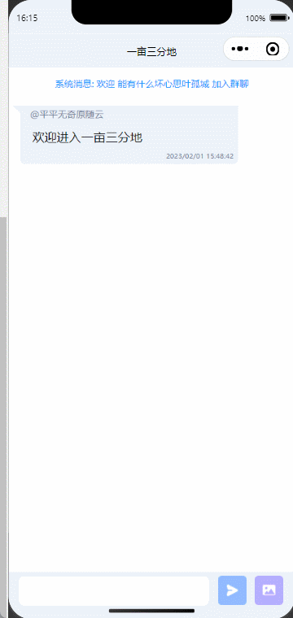

## 这是一个不需要后端服务代码，而服务端使用memfire cloud实现的全栈微信小程序的简易实时聊天室



## 安装依赖
```js
npm i

```

## 配置客户端

### 在lib/supabase.js文件下，将在MemFire Cloud创建应用的apikey和url配置到相应的地方

## 创建项目

需要以下数据库表。

| Field            | Type      |
| ---------------- | --------- |
| id               | BIGINT    |
| username         | VARCHAR   |
| text             | TEXT      |
| timestamp        | timestamp |

## sql

```sql
CREATE TABLE messages (
  id bigint GENERATED BY DEFAULT AS IDENTITY PRIMARY KEY,
  username VARCHAR NOT NULL,
  text TEXT NOT NULL,
  timestamp timestamp default now() NOT NULL
);
```
